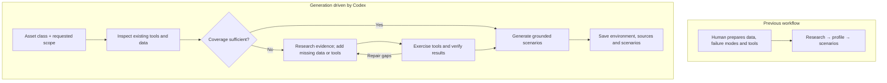

# Agent-driven scenario generation

A normal generation command accepts an asset class, inspects the available
environment, and fills gaps before producing scenarios. Experiment setup belongs
outside the agent's instructions.

```bash
scenario-generate --asset-class Transformer
```

## Workflow



Reuse existing sensors, endpoints, failure modes and records whenever suitable.
A new asset class does not automatically require new data or tools. The agent
uses ordinary Python and MCP; the instructions define evidence and output
requirements without prescribing its research or repair loop.

## Implementation

All new generation code lives in `src/scenarios/generation`. The
[usage guide](../src/scenarios/generation/README.md) documents the command.

| Concern | Approach |
| --- | --- |
| User surface | Asset class, count and domains are request inputs. Defaults: Codex, GPT-6 Astra, extra-high reasoning, fast service. |
| Native execution | Codex can search, edit files, run Python and call MCP tools. A small command-builder boundary allows other harnesses later. |
| Environment | Export the chosen committed environment with its existing tools, fixtures and models. Initialize the normal manifest in a separate database. |
| Missing asset support | Research failure modes and sensor relationships, prepare evidence-backed data, and add only missing diagnostic capabilities. |
| Data access | Official Kaggle, Hugging Face and UCI clients plus native web search. Preserve versions, licenses, hashes, transformations and source claims. |
| Validation | Resolve referenced assets, sensors, time windows and work orders. Exercise generated tools and test diagnostic rules against known cases. |
| Evaluation | Keep scenario execution and judging on the existing runners; no harness changes to evaluation. |

A source snapshot has no target-specific removal rules or pinned Transformer
baseline. Experimental exclusions are prepared before invoking the normal
command. The model receives the requested asset and available environment,
without being told that an integration was withheld.

## Data access

Configure Kaggle once with `kaggle auth login`. The native client uses that
account's login for searches and downloads; nothing belongs in prompts or Git.
Each contributor can use their own configured account. Public HF, UCI and
permitted Kaggle resources remain alternatives when authentication is unavailable.

```bash
kaggle datasets list --search "power transformer" --csv
```

The current container mounts Codex and Kaggle credentials read-only. This allows
native authentication; it does not hide credentials from code inside that
container. A separate dataset service is an optional future boundary if needed.
[Kaggle authentication](https://github.com/Kaggle/kaggle-cli/blob/main/docs/README.md#authentication).

## First execution

After reviewing the normal command, run it for Transformer with five scenarios:
one each for IoT, FMSR, TSFM, WO and Vibration. An unsupported domain should yield
an explicit insufficient-data scenario or a reported gap. Keep observed values,
derived relationships and synthetic workflow records clearly distinguished.

Inspect the short README, scenarios, profile, sources, environment setup and
new code. Validate a fresh rebuild before promoting generated integrations.
No performance comparison or judge run is required for this first inspection.
The earlier reconstruction run was cancelled and is not a result of this workflow.

The fork's `main` carries the new atomic implementation commits on IBM's base.
Keep `codex/rohith-transformer-integration` as a separate reference and retain
`feat/scenario-generator-profiling`. Local historical runs remain archived.

## Remaining work

Codex is the initial harness; Claude Code and custom harnesses are extension
points. New generated algorithms still require source and validity review.
Live external database connections and multi-agent scenario composition can
follow the first execution. Existing local evaluation and older generator edits
remain unstaged for separate review.

Keep functions small, dependencies within generation, and commits preferably
under 500 changed lines. Promote reusable server integrations separately from
raw data and trajectories.
