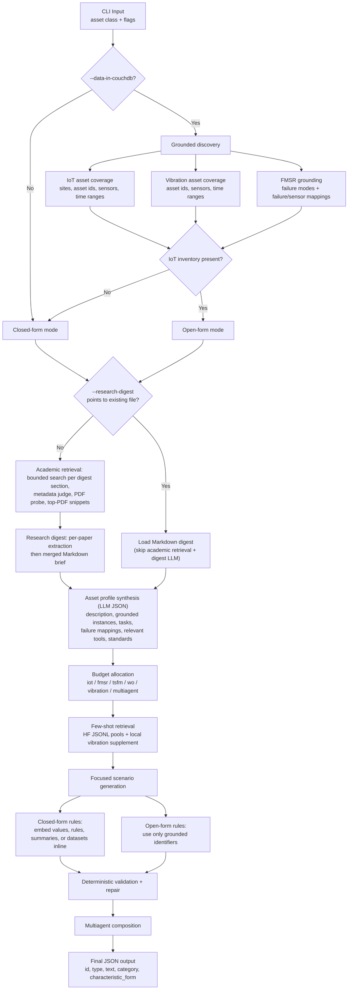

# Scenario Generator

LLM-driven pipeline for generating AssetOpsBench scenarios from an asset class such as `"Motor"`, `"Transformer"`, or `"Hydrolic Pump"`.

The generator works in two modes:

- `closed_form`: self-contained scenarios where the query itself provides the needed values, rules, summaries, or dataset references.
- `open_form`: grounded scenarios that use live CouchDB-backed identifiers discovered from IoT and vibration coverage.

> **Open-form disclaimer:** For grounded `open_form` runs (`--data-in-couchdb`), configure `.env` (or the process environment) so **`IOT_DBNAME`**, **`WO_DBNAME`**, and **`VIBRATION_DBNAME`** each point to live CouchDB databases that actually contain data relevant to the **asset name** you pass on the CLI (for example `"Transformer"` or `"Motor"`). If these names point at the wrong or empty databases, IoT, work-order, and vibration grounding will be misleading or sparse for that asset.

> **Academic retrieval and research digest:** Asset profile construction (Phase 1) runs **grounded discovery** first (full CouchDB IoT/vibration/FMSR discovery only when **`--data-in-couchdb`** is set), then **academic evidence retrieval**, then a **two-step research digest** (per-paper structured extraction, then merge into one Markdown brief), unless you supply a precomputed digest (see below). The `--retriever` flag selects the search backend; default is **`arxiv`**. Use **`--retriever semantic_scholar`** for Semantic Scholar instead.
>
> **Semantic Scholar retrieval:** When using `--retriever semantic_scholar`, set **`SEMANTIC_SCHOLAR_API_KEY`** in `.env` (optional but recommended for higher API rate limits). The CLI does not accept the key as a flag; only the environment variable is read. If unset, the public rate limits apply.
>
> **Precomputed research digest:** Pass **`--research-digest PATH`** to a Markdown file that already contains the merged research brief. If that path exists, the run **skips** academic search, PDF/snippet retrieval, and digest LLM calls, and feeds that file straight into asset profile construction. If the path does not exist, the CLI exits with an error.

>  For **new asset classes**, add or update **`_ASSET_FAILURE_MODE_ALIASES`** in [`src/servers/fmsr/main.py`](../servers/fmsr/main.py) when the CLI-facing name should map to a different curated failure-mode key in [`failure_modes.yaml`](../servers/fmsr/failure_modes.yaml); otherwise FMSR may fall back to LLM-only failure lists. See **Asset class → curated FMSR failure modes** below for the full picture.

The run writes a JSON **array** of scenarios. Each object has this shape:

```json
{
  "id": "transformer_scenario_01",
  "type": "fmsr",
  "text": "…",
  "category": "Diagnostic Assessment",
  "characteristic_form": "…"
}
```

Allowed `type` values: `iot`, `fmsr`, `tsfm`, `wo`, `vibration`, `multiagent`. Few-shot source JSONL files under [`huggingface/`](huggingface/) still use their own `type` column labels (e.g. `IoT`, `Workorder`) when filtering examples; generated `scenarios.json` uses the canonical keys above. See [`models.py`](models.py) (`Scenario`, `ScenarioTypeKey`).

## CLI

From the **repository root**, use [uv](https://docs.astral.sh/uv/) so imports resolve for `scenarios`, `agent`, `llm`, and `servers` (same layout as `tool.pytest.ini_options.pythonpath` in `pyproject.toml`):

```bash
uv run python -m scenarios.generator "<Asset Class>" [options]
```

Key flags:

| Flag | Default | Description |
|---|---|---|
| `asset_name` | required | Asset class name, for example `"Motor"` or `"Transformer"` |
| `--num-scenarios N` | `50` | Total number of scenarios to generate |
| `--model-id MODEL` | project default | LiteLLM model override |
| `--retriever {arxiv,semantic_scholar}` | `arxiv` | Academic search backend for evidence retrieval (omit flag for default) |
| `--research-digest PATH` | unset | If set and the file exists, skip retrieval and digest LLM steps; load this Markdown as the research brief for the asset profile |
| `--data-in-couchdb` | off | Enable grounded open-form generation when live IoT inventory exists (requires `.env` DB names; see open-form disclaimer above) |
| `--show-workflow` | off | Print phase-by-phase progress (Phases 1–4: asset profile → budget → per-focus generation → multiagent), including live repair counts |
| `--log` | off | Write prompts and responses under `logs/` next to `scenarios.json` (same run folder) |

Output is always `generated/scenarios/<asset_slug>_scenarios_<YYYYMMDD_HHMMSS>/scenarios.json` (not configurable; slug from [`text.slugify_asset_name`](text.py)).

Examples:

```bash
# Run from the repository root
# Closed-form, self-contained scenarios only
uv run python -m scenarios.generator "Transformer" --num-scenarios 20

# Grounded open-form: Semantic Scholar retrieval, CouchDB grounding, console workflow, and full disk logs
uv run python -m scenarios.generator "Transformer" --show-workflow --log --data-in-couchdb --retriever "semantic_scholar"

# Grounded open-form with verbose workflow (no --log)
uv run python -m scenarios.generator "Motor" --data-in-couchdb --show-workflow

# Reuse a saved research digest (skips academic retrieval and digest synthesis)
uv run python -m scenarios.generator "Transformer" --research-digest ./my_digest.md

# Debug run with raw logs (hydraulic pump asset class)
uv run python -m scenarios.generator "Hydrolic Pump" --data-in-couchdb --show-workflow --log
```

## Code layout

Tree is rooted at `src/scenarios/` (this package). Comments describe each part.

```text
scenarios/
├── generator/
│   ├── __main__.py
│   ├── cli.py                 # entry for python -m scenarios.generator
│   ├── agent.py               # ScenarioGeneratorAgent
│   └── prompt_helpers.py      # prompt fragments, default paths, workflow printing
├── grounding.py               # IoT inventory, vibration overlay, FMSR mapping; optional failure_mapping/ cache
├── retrieval/
│   ├── base.py                # EvidenceMetadataExecutor protocol
│   ├── arxiv.py               # ArXiv metadata + PDF text
│   ├── semantic_scholar.py    # Semantic Scholar Graph API
│   ├── pdf_http.py            # PDF URL probing and fetch helpers
│   ├── digest.py              # synthesize_research_digest (per-paper + merge LLM steps)
│   └── pipeline.py            # retrieve_asset_evidence: section-wise search loops, snippets
├── constraints/
│   ├── policies.py            # focus policies for prompts
│   └── validation.py          # deterministic validation / repair loop
├── prompts/
│   ├── research_digest.py     # digest section headings and per-paper / merge prompts
│   ├── asset_profile.py
│   ├── budget.py
│   ├── generation.py
│   └── retrieval.py
├── huggingface/
│   ├── scenarios/             # e.g. all_utterance.jsonl
│   ├── asset/                 # e.g. compressor / hydrolic pump utterances
│   └── task/                  # e.g. failure mapping, rule monitoring JSONL
├── local/
│   └── vibration_utterance.json   # few-shot examples for vibration focus only
├── failure_mapping/           # on-disk FMSR fm2sensor / sensor2fm cache (e.g. <slug>.json)
├── models.py                  # AssetProfile, GroundingBundle, Scenario, …
├── utils.py                   # fetch_hf_fewshot, parse_llm_json
└── text.py                    # slugs, text normalization for dedup and prompts
```

## High-level flow



## Pipeline

### 1. Grounded discovery

Runs when `--data-in-couchdb` is enabled.

- Enumerates IoT assets via the IoT server (`get_asset_list`, sensors, time ranges).
- Joins vibration coverage by `(site_name, asset_id)`.
- Calls FMSR for failure modes and failure-to-sensor mapping (with optional cache files in [`failure_mapping/<slug>.json`](failure_mapping/)).
- If there is no IoT inventory at all, the run uses `closed_form` (`open_form_eligible` false).
- In grounded runs, focuses without live support can be allocated `0` budget instead of inventing identifiers.

### Asset-class mapping notes

Coherent open-form runs depend on the CLI `asset_name` aligning with how servers resolve assets:

#### 1. CLI label and IoT / vibration inventory

[`discover_grounding`](grounding.py) loads the full IoT inventory exposed by the IoT server; it does not substring-filter asset rows by the CLI string. Vibration rows are merged when `(site_name, asset_id)` matches. For scenarios that mention specific assets, use ids and sites that actually appear in the grounded bundle and profile.

#### 2. Asset class → curated FMSR failure modes

FMSR failure-mode grounding is most reliable when the asset class maps to a curated key instead of falling back to the LLM.

Curated failure modes live in:

- [`src/servers/fmsr/failure_modes.yaml`](../servers/fmsr/failure_modes.yaml)

Alias resolution for lookup lives in:

- [`src/servers/fmsr/main.py`](../servers/fmsr/main.py) via `_ASSET_FAILURE_MODE_ALIASES` and `_resolve_failure_mode_asset_key()`

Concrete example:

- CLI input: `"Transformer"`
- IoT asset id: `"Transformer 1"`
- curated FMSR key: `"smart grid transformer"`

That works because `Transformer -> smart grid transformer` is explicitly aliased in FMSR.

If you add a new asset class, make sure at least one of these is true:

- the normalized CLI asset class exactly matches a key in `failure_modes.yaml`
- or there is an explicit alias in `_ASSET_FAILURE_MODE_ALIASES`
- or you are intentionally accepting slower, less deterministic LLM fallback behavior

Recommended rule:

- For production-ish grounded generation, prefer adding a curated `failure_modes.yaml` entry plus an alias if the CLI-facing name differs from the curated key.

#### 3. Failure / sensor grounding

After failure modes are found, grounding builds failure-to-sensor views for scenario generation in [`grounding.py`](grounding.py): either from a cache file under `failure_mapping/` or from `get_failure_mode_sensor_mapping` (then written to cache).

#### 4. Asset class → vibration coverage

`vibration` is only meaningful in open-form when the vibration database has rows for the same `(site_name, asset_id)` pairs as IoT.

Relevant code:

- [`src/servers/vibration/couchdb_client.py`](../servers/vibration/couchdb_client.py)
- [`src/scenarios/grounding.py`](grounding.py)

Important consequence:

- If IoT has `Transformer 1` but vibration has no matching row, grounded generation can still run, but vibration-focused scenarios may receive `0` budget if the profile has no vibration sensors.

#### 5. Quick checklist when adding a new asset class

- FMSR: curated `failure_modes.yaml` entry and/or alias, or accepted LLM fallback.
- IoT / vibration: asset ids and sites match what you want referenced in open-form text.
- Large sensor sets: consider caching under `failure_mapping/<slug>.json` after the first successful mapping.
- Few-shot pools include examples adjacent to the new class or focus (see [`utils.py`](utils.py)).

#### 6. Troubleshooting example: Transformer

For the transformer case, a typical mapping is:

- CLI asset class: `"Transformer"`
- grounded IoT asset: `"Transformer 1"`
- grounded vibration assets: often none
- curated FMSR family: `"smart grid transformer"`

Expected behavior:

- open-form is enabled when IoT inventory exists
- `iot`, `fmsr`, `tsfm`, and `wo` can receive budget
- `vibration` may be `0` without vibration rows

If a run stalls or falls back unexpectedly, inspect:

- IoT DB content and IoT server behavior
- FMSR aliases for `Transformer`
- FMSR mapping cache and logs under `failure_mapping/`

### 2. Asset profile synthesis

Phase 1 always runs [`discover_grounding`](grounding.py) first (full CouchDB IoT/vibration/FMSR work only when `--data-in-couchdb` is set; otherwise the bundle stays in closed-form shape). Then literature and digest steps depend on **`--research-digest`**:

- **Precomputed digest:** If `--research-digest PATH` is set and the file exists, academic retrieval and digest LLM calls are skipped; that Markdown is passed into the profile builder as the research brief.
- **Live pipeline:** Otherwise [`retrieve_asset_evidence`](retrieval/pipeline.py) runs. For each merge-section heading in [`prompts/research_digest.py`](prompts/research_digest.py) (for example condition monitoring, maintenance context, sensor modalities, failure modes, standards, operator/manager tasks), the planner issues bounded search queries against the configured backend (`arxiv` default or `semantic_scholar`), judges metadata relevance, keeps candidates whose PDF URLs pass an HTTP probe, downloads up to a few top PDFs, and builds text snippets. [`synthesize_research_digest`](retrieval/digest.py) then runs **per-paper** structured extraction followed by a **merge** pass into one Markdown digest.

The final [`PROFILE_BUILDER_PROMPT`](prompts/asset_profile.py) call combines:

- the grounding summary (JSON)
- the merged research digest (Markdown)
- available tool descriptions from the MCP servers

The resulting asset profile includes:

- asset-class description
- grounded per-instance coverage
- known failure modes
- failure-to-sensor and sensor-to-failure mappings
- relevant tools by focus
- operator-facing tasks
- manager-facing tasks
- standards and conventions

### 3. Budget allocation

Budget is allocated across:

- `iot`
- `fmsr`
- `tsfm`
- `wo`
- `vibration`
- `multiagent`

Special handling:

- `vibration=0` when grounded open-form coverage does not include matching vibration-backed assets for the asset class.
- `multiagent` is capped at **75%** of the total budget (see `_multiagent_budget_cap` in [`generator/prompt_helpers.py`](generator/prompt_helpers.py)).

### 4. Few-shot retrieval

Few-shot examples are drawn from the JSONL files under [`huggingface/`](huggingface/) and, for vibration, from [`local/vibration_utterance.json`](local/vibration_utterance.json). Per-focus sourcing is implemented in [`utils.py`](utils.py) (`_build_candidate_pool`):

- **iot / wo**: filtered rows from `huggingface/scenarios/all_utterance.jsonl`
- **fmsr**: `huggingface/task/failure_mapping_senarios.jsonl` (bucketed shapes)
- **tsfm**: `huggingface/task/rule_monitoring_scenarios.jsonl` (diverse entities)
- **vibration**: `local/vibration_utterance.json`
- **multiagent**: `huggingface/asset/compressor_utterance.jsonl`, `huggingface/asset/hydrolicpump_utterance.jsonl`, plus multiagent rows from `all_utterance.jsonl`

Ranking considers:

- asset/entity similarity
- focus similarity
- closed-form vs open-form fit
- operator or manager wording fit

### 5. Scenario generation and validation

Generation is budgeted and validated per focus lane; the same lane is serialized as `type` in the output. [`constraints`](constraints/) enforces:

- required schema fields
- duplicate avoidance
- clear primary focus
- self-contained closed-form requests
- grounded identifiers for open-form requests
- at least two namespaces for multiagent workflows

Cross-focus support is allowed as long as the primary focus remains clear.

## Closed-form vs open-form

### Closed-form

Closed-form scenarios must be solvable from the query itself. They can include:

- DGA readings
- rule definitions
- maintenance summaries
- sensor/value snippets
- dataset names and evaluation requests

Example:

```text
Interpret the DGA gas readings for transformer: Hydrogen 100 ppm, Methane 50 ppm, Acetylene 5 ppm, Ethylene 20 ppm, Ethane 10 ppm.
```

### Open-form

Open-form scenarios may require live retrieval, but every concrete identifier must come from grounded discovery. That includes:

- site names
- asset ids
- sensor names
- explicit time bounds

## Output file

`scenarios.json` is a JSON array of objects matching the schema at the top of this document. Field meanings: `id` (stable id), `type` (benchmark lane: `iot`, `fmsr`, `tsfm`, `wo`, `vibration`, or `multiagent`), `text` (user request), `category`, `characteristic_form` (expected tools and answer shape).

## Logs

When `--log` is enabled, prompts and raw responses are written under `generated/scenarios/<asset>_scenarios_<timestamp>/logs/`, next to `scenarios.json`. Stage-specific subdirectories mirror the pipeline steps.

Typical files include (within each stage folder, filenames are prefixed with a per-folder step counter such as `01_`, `02_`):

- `01_grounding/` — grounded bundle JSON (`discovery.json` stem)
- `02_retrieval/paper_search/<section_slug>/step_*.txt` — one bounded ReAct loop per research-digest section; `02_retrieval/paper_search/summary.txt` — final ranked pool and selected PDFs
- optional `02_retrieval/paper_search/raw_arxiv.json` or `raw_semantic_scholar.json` — raw API payloads when using those backends
- `02_retrieval/paper_digest/per_paper_*.txt` and `merged.txt` — produced by live digest synthesis; with **`--research-digest`** there are no per-paper steps, but **`--log`** still writes `merged.txt` from the loaded file
- `03_asset_profile/prompt.txt`, `response.json`, and `final_asset_profile.json`
- `04_budget/prompt.txt` and `response.json`
- `05_generation/<focus>/generation_prompt.txt`, `generation_response.json`, and validate/repair prompts under the same focus folder (including `multiagent`, which uses the multi-agent combiner prompt in the same layout as other focuses)
- optional `05_generation/<focus>/deterministic_failures_attempt_*.json` when validation fails and retries

