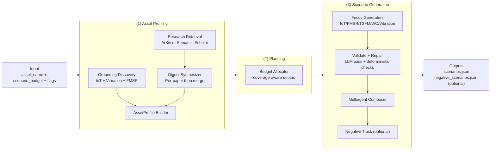

# Scenario Generator

The scenario generator builds AssetOpsBench prompts for an asset class (for example, `"Motor"` or `"Transformer"`).  
Output is a JSON array of validated scenarios with canonical lane types:
`iot`, `fmsr`, `tsfm`, `wo`, `vibration`, `multiagent`.

The pipeline supports two generation modes:

- `closed_form`: the request is fully answerable from text in the prompt itself.
- `open_form`: the request is grounded in live identifiers discovered from IoT/vibration/FMSR sources.

## Module-level Architecture




## End-to-end Flow

1. **Grounding (optional for open-form)**
  If `--data-in-couchdb` is set, the system discovers asset instances, sensors, time ranges, and failure mappings. This step defines which concrete identifiers are allowed in open-form prompts.
2. **Evidence and digest**
  If `--research-digest PATH` exists, it is loaded directly. Otherwise, bounded academic retrieval runs, then a two-step digest synthesis (per-paper extraction + merge). This keeps profile synthesis evidence-backed.
3. **Asset profile construction**
  The profile merges grounded data, research digest content, and tool descriptions. This is the single structured context used by all downstream generators.
4. **Budget allocation**
  Scenarios are allocated across focus lanes. `multiagent` is capped at 75% of total budget to preserve lane diversity.
5. **Generation and validation**
  Per-focus scenarios are generated, repaired, and deterministically validated for schema, grounding, and uniqueness requirements.
6. **Multiagent composition**
  Multiagent scenarios are generated from validated single-focus candidates to build cross-tool workflows.
7. **Negative scenario generation (optional)**
  Controlled by `--num-negative-scenarios`; generated strictly after multiagent composition and not counted against `--num-scenarios`.

## Operational Configuration

### Required `.env` keys for grounded runs

When `--data-in-couchdb` is enabled, these environment variables must point to real, populated databases for the selected asset family:

- `IOT_DBNAME`
- `WO_DBNAME`
- `VIBRATION_DBNAME`

If these values are missing, empty, or mismatched to the asset class, open-form grounding quality degrades (and falls back to closed-form when IoT inventory is empty).

### Retriever configuration

- `--retriever arxiv` requires no additional key.
- `--retriever semantic_scholar` should use `SEMANTIC_SCHOLAR_API_KEY` (optional but recommended for better rate limits).

### Runtime constants and limits

- Output root is fixed to `generated/scenarios/` (`DEFAULT_GENERATED_SCENARIOS_DIR`).
- `multiagent` allocation cap is `75%` of requested total (`_multiagent_budget_cap`).
- Validation/retry loops are bounded (`_MAX_SCENARIO_ATTEMPTS`).
- Canonical lane ordering follows `FOCUS_ORDER` in constraints.

## CLI

Run from repository root:

```bash
uv run python -m scenarios.generator "<Asset Class>" [options]
```

### Key arguments


| Flag                                   | Default         | Description                                             |
| -------------------------------------- | --------------- | ------------------------------------------------------- |
| `asset_name`                           | required        | Asset class name                                        |
| `--num-scenarios N`                    | `50`            | Number of validated scenarios                           |
| `--num-negative-scenarios N`           | `2`             | Number of negative scenarios (`0` disables)             |
| `--model-id MODEL`                     | project default | LiteLLM model override                                  |
| `--retriever {arxiv,semantic_scholar}` | `arxiv`         | Academic backend                                        |
| `--research-digest PATH`               | unset           | Use precomputed digest, skip retrieval+digest synthesis |
| `--data-in-couchdb`                    | off             | Enable grounded open-form discovery                     |
| `--show-workflow`                      | off             | Print phase-level progress                              |
| `--log`                                | off             | Write prompts/artifacts under run `logs/`               |


### Retrieval notes

- With `--retriever semantic_scholar`, set `SEMANTIC_SCHOLAR_API_KEY` (env var) for higher rate limits.
- If `--research-digest PATH` is provided and the file is missing, the run exits with an error.

### Open-form data requirements

For grounded runs, set `IOT_DBNAME`, `WO_DBNAME`, and `VIBRATION_DBNAME` to live CouchDB databases for the selected asset class.  
If IoT inventory is empty, generation falls back to `closed_form`.

### CLI examples

```bash
# 1) Closed-form baseline: generate 20 validated scenarios.
uv run python -m scenarios.generator "Transformer" --num-scenarios 20

# 2) Grounded open-form run: discover live identifiers from CouchDB and generate 30 scenarios.
uv run python -m scenarios.generator "Motor" --data-in-couchdb --num-scenarios 30

# 3) Grounded run with workflow output: print phase-by-phase progress in the console.
uv run python -m scenarios.generator "Transformer" --data-in-couchdb --show-workflow

# 4) Grounded run with persisted logs: write prompts and artifacts under generated/.../logs/.
uv run python -m scenarios.generator "Transformer" --data-in-couchdb --show-workflow --log

# 5) Semantic Scholar backend: use Semantic Scholar for academic retrieval.
uv run python -m scenarios.generator "Transformer" --retriever semantic_scholar --data-in-couchdb

# 6) Reuse a precomputed digest: skip retrieval and digest synthesis.
uv run python -m scenarios.generator "Transformer" --research-digest ./my_digest.md

# 7) Disable negative track: produce only scenarios.json.
uv run python -m scenarios.generator "Hydrolic Pump" --num-negative-scenarios 0

# 8) Evaluation run: generate 80 positive scenarios and 10 negative scenarios.
uv run python -m scenarios.generator "Transformer" --num-scenarios 80 --num-negative-scenarios 10 --data-in-couchdb --log
```

## Outputs

Each run writes:

- `generated/scenarios/<asset_slug>_scenarios_<timestamp>/scenarios.json`
- optional `negative_scenarios.json` in the same directory

Scenario object schema:

```json
{
  "id": "transformer_scenario_01",
  "type": "fmsr",
  "text": "...",
  "category": "Diagnostic Assessment",
  "characteristic_form": "..."
}
```

## Logs (when `--log` is enabled)

Artifacts are written under:
`generated/scenarios/<asset_slug>_scenarios_<timestamp>/logs/`

Main folders:

- `01_grounding/`
- `02_retrieval/` (`paper_search`, `paper_digest`)
- `03_asset_profile/`
- `04_budget/`
- `05_generation/<focus>/`
- `06_negative_generation/<focus>/` (if enabled)

## Source Layout

```text
scenarios/
├── generator/      # CLI + orchestration
├── grounding.py    # IoT/vibration/FMSR grounding + cache
├── retrieval/      # metadata search, PDF handling, digest synthesis
├── constraints/    # validation and repair constraints
├── prompts/        # prompt templates by stage
├── huggingface/    # few-shot corpora
├── local/          # local few-shot supplements
├── failure_mapping/# cached FMSR mappings
├── models.py
├── utils.py
└── text.py
```

## Asset-class Mapping Guidance

For reliable grounded FMSR behavior on new asset classes:

- add a curated key in `src/servers/fmsr/failure_modes.yaml`, and/or
- add an alias in `src/servers/fmsr/main.py` (`_ASSET_FAILURE_MODE_ALIASES`)

Without this, the system may rely on less deterministic fallback behavior.