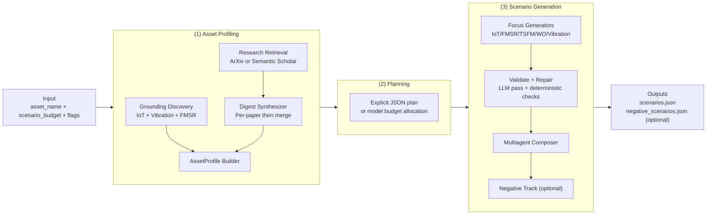

# Scenario generator

Generate scenario JSON from technical literature, available tools, and local asset data. Codex CLI is the default generation backend; Claude Code is an alternative.

Generation lives in `src/scenarios`: research retrieval, profiling, planning, prompts, validation, inventory discovery, and the Codex adapter. It reads existing MCP tool schemas without using the plan-execute agent. Execution and judging consume the saved scenarios separately.

## How generation works


```mermaid
flowchart LR
    I["Input<br/>asset_name + scenario_budget + flags"]

    subgraph P1["(1) Asset Profiling"]
      G["Grounding Discovery<br/>IoT + Vibration + FMSR"]
      R["Research Retrieval<br/>ArXiv or Semantic Scholar"]
      D["Digest Synthesizer<br/>Per-paper then merge"]
      AP["AssetProfile Builder"]
      G --> AP
      R --> D --> AP
    end

    subgraph P2["(2) Planning"]
      B["Explicit JSON plan<br/>or model budget allocation"]
    end

    subgraph P3["(3) Scenario Generation"]
      F["Focus Generators<br/>IoT/FMSR/TSFM/WO/Vibration"]
      V["Validate + Repair<br/>LLM pass + deterministic checks"]
      M["Multiagent Composer"]
      N["Negative Track (optional)"]
      F --> V --> M --> N
    end

    O["Outputs<br/>scenarios.json<br/>negative_scenarios.json (optional)"]

    I --> P1 --> P2 --> P3 --> O
```

The generator discovers available MCP tools, gathers research, and builds an asset profile. It then generates the requested scenarios, reviews them with the model, and runs deterministic checks before accepting them.

The checks cover required fields, explicit tool references, duplicate wording, and—for positive scenarios—focus coverage and basic live-data grounding. The model reviews realism and whether negative scenarios are unanswerable. Passing these checks still leaves room for a human quality review.

With `--log`, the numbered folders inside `logs/` follow the diagram: grounding, retrieval, asset profile, counts, generation, and negative generation. Generation logs include prompts, responses, and any recorded validation failures.

## CLI

Run commands from the repository root. The command is structured like this:

```text
uv run python -m scenarios.generator <asset-class>
  [--backend <backend>] [--model-id <model>]
  [--scenario-plan <json> | --scenario-counts <json>]
  [--mode <mode>]
  [--retriever <provider>] [--reuse-research <file>]
  [--batch-size <count>] [--show-workflow] [--log]
```

Replace `<placeholders>` with actual values; `[]` marks optional parts and `|` separates alternatives.

To see help in your terminal:

```bash
uv run python -m scenarios.generator --help
```

### Choose scenarios by focus

**Positive scenarios** ask questions the available data and tools can answer. **Negative scenarios** test whether an agent recognizes missing information or an unsupported request and explains the limitation.

This example uses a local Codex login to generate scenarios for the Transformer asset class: 10 positive and 2 negative IoT scenarios, plus 5 positive and 1 negative FMSR scenario.

```bash
codex login
uv run python -m scenarios.generator "Transformer" \
  --backend codex \
  --scenario-plan '{
    "iot": {"positive": 10, "negative": 2},
    "fmsr": {"positive": 5, "negative": 1}
  }'
```

Pass the JSON object directly to `--scenario-plan`. Each entry specifies a focus and how many positive and negative scenarios to generate.

| Focus | Area of work |
| --- | --- |
| `iot` | Asset discovery, sensors, and telemetry |
| `fmsr` | Failure modes and engineering assessments |
| `tsfm` | Time-series analysis, forecasting, and model evaluation |
| `wo` | Work orders and maintenance planning |
| `vibration` | Vibration analysis and diagnostics |
| `multiagent` | Tasks involving two or more of these areas |

### Let the model choose the mix

Use total counts when you want the generator to distribute scenarios across focuses:

```bash
uv run python -m scenarios.generator "Transformer" \
  --backend codex \
  --scenario-counts '{"positive":20,"negative":4}'
```

Choose `--scenario-plan` to set counts for each focus, or `--scenario-counts` to give totals and let the generator distribute them. With neither option, the generator requests 50 positive and 2 negative scenarios.

### Use live data and save the logs

```bash
uv run python -m scenarios.generator "Transformer" \
  --backend codex \
  --scenario-plan '{"iot":{"positive":10,"negative":2}}' \
  --mode open \
  --retriever semantic_scholar \
  --show-workflow --log
```

This uses registered assets and sensor data, gathers research through Semantic Scholar, prints progress, and saves the generation prompts and responses.

### Arguments and their values

The asset class is required. Each named argument below is optional, but takes a value when used. Quote names and paths containing spaces, and wrap JSON in single quotes.

| Command part | Value to supply | Example |
| --- | --- | --- |
| `<asset-class>` | The asset class, directly after `scenarios.generator`. | `"Transformer"` |
| `--scenario-plan <json>` | An object containing positive and negative counts for each focus. | `--scenario-plan '{"iot":{"positive":10,"negative":2}}'` |
| `--scenario-counts <json>` | An object containing positive and negative totals for automatic distribution. | `--scenario-counts '{"positive":20,"negative":4}'` |
| `--backend <backend>` | `codex`, `claude-code`, `glm`, or `litellm`. Defaults to `codex`. | `--backend codex` |
| `--mode <mode>` | `open` requires matching live asset inventory; `closed` generates self-contained questions. Defaults to `closed`. | `--mode open` |
| `--model-id <model>` | A model supported by the chosen backend. See [backend defaults](#backend-setup). | `--model-id gpt-6-astra` |
| `--retriever <provider>` | `arxiv` or `semantic_scholar`. Defaults to `arxiv`. | `--retriever semantic_scholar` |
| `--reuse-research <file>` | The path to an existing Markdown or text research brief. | `--reuse-research ./research-brief.md` |
| `--batch-size <count>` | The maximum positive scenarios per generation batch. Defaults to `5`. | `--batch-size 5` |

### Flags that stand alone

Add these without a following value:

| Flag | What it does |
| --- | --- |
| `--show-workflow` | Print progress through the generation steps. |
| `--log` | Save prompts, responses, and intermediate results. |
| `--help` | Show command usage and exit. |

## Backend setup

The selected backend and model handle research synthesis, profile building, generation, and review.

All stages request an output budget of 128K (131,072) tokens, capped at the
model's known maximum output length. Z.ai limits use its documented API limits;
other exact model IDs use the installed LiteLLM catalog. Unknown model IDs and
CLI aliases retain the 128K request budget because their limits cannot be
resolved locally. Codex treats this budget as advisory; its CLI controls the
actual output limit. This budget is a ceiling, not a requested response length.

| Backend | Setup | Default model |
| --- | --- | --- |
| `codex` | Run `codex login`. | Codex CLI default; override with `--model-id` |
| `claude-code` | Run `claude auth login`. | `sonnet` |
| `glm` | Set `ZAI_API_KEY` in `.env`. | `glm-5.3` |
| `litellm` | Set Watsonx or LiteLLM credentials in `.env`. | Watsonx Llama 4 Maverick |

Codex uses its existing login; no separate AssetOpsBench registration is needed. To switch accounts, select the appropriate Codex login directory with `CODEX_HOME` before launching generation. The subprocess inherits it. Claude Code also manages its own login. API credentials stay in your local `.env`.

## Data and research

### Self-contained or live-data questions

With `--mode closed` (the default), scenarios include the readings and context needed to answer the question. This is called **closed form**.

With `--mode open`, scenarios refer to actual assets, sensors, and time ranges discovered in the configured databases. This is called **open form**. If no matching assets are found, generation stops with guidance to check the database connection and asset inventory. It does not switch modes.

For live-data runs, set the CouchDB connection in your local `.env`; [`.env.public`](../../.env.public) lists the keys. Asset discovery uses the asset registry and telemetry; failure-mode and vibration data add context where available. Model calls and research retrieval use the network in both modes.

### Fresh or saved research

The default research source is arXiv. Use `--retriever semantic_scholar` for Semantic Scholar; `SEMANTIC_SCHOLAR_API_KEY` is optional and recommended for higher rate limits.

To reuse a research brief, add `--reuse-research ./research-brief.md`. This skips literature retrieval and research synthesis. Profile building, generation, and review still run.

## Outputs

Each run saves its results in a new directory under `generated/scenarios/` and prints the output paths.

| File | Contents |
| --- | --- |
| `scenarios.json` | Positive scenarios |
| `negative_scenarios.json` | Negative scenarios, when requested |
| `run.json` | Configuration, requested counts, and completion status |
| `logs/` | Prompts, responses, and intermediate results when `--log` is enabled |

Each scenario contains:

| Field | Meaning |
| --- | --- |
| `id` | Generated scenario identifier |
| `type` | Focus, such as `iot` or `multiagent` |
| `text` | The operator's question or request |
| `category` | Task label, such as `Data Query` or `Diagnostic Assessment` |
| `characteristic_form` | Expected behavior: relevant tools, evidence, analysis, and response |

Tool references such as `iot.history` belong in `characteristic_form`. The operator-facing `text` uses natural language.

## Python API

Pass the same scenario-count object to `GeneratorConfig`:

```python
import asyncio
from dotenv import load_dotenv
from scenarios.generator import GeneratorConfig, generate_scenarios

load_dotenv()
config = GeneratorConfig(
    asset_name="Transformer",
    backend="codex",
    scenario_plan={
        "iot": {"positive": 10, "negative": 2},
        "fmsr": {"positive": 5, "negative": 1},
    },
    mode="open",
    retriever="semantic_scholar",
    log=True,
)
run = asyncio.run(generate_scenarios(config))
print(run.output_path, run.complete)
```

`generate_scenarios` manages execution and saved results. Pass `output_dir` to choose a new output directory. `run.complete` reports whether all requested counts were met, including each focus when using a scenario plan.

For automatic distribution in Python, replace `scenario_plan` with `scenario_counts={"positive":20,"negative":4}`.

For implementation details, see [configuration](config.py), [scenario counts](planning.py), [backend adapters](backends.py), [generation](generator/agent.py), and [validation](constraints/validation.py).
