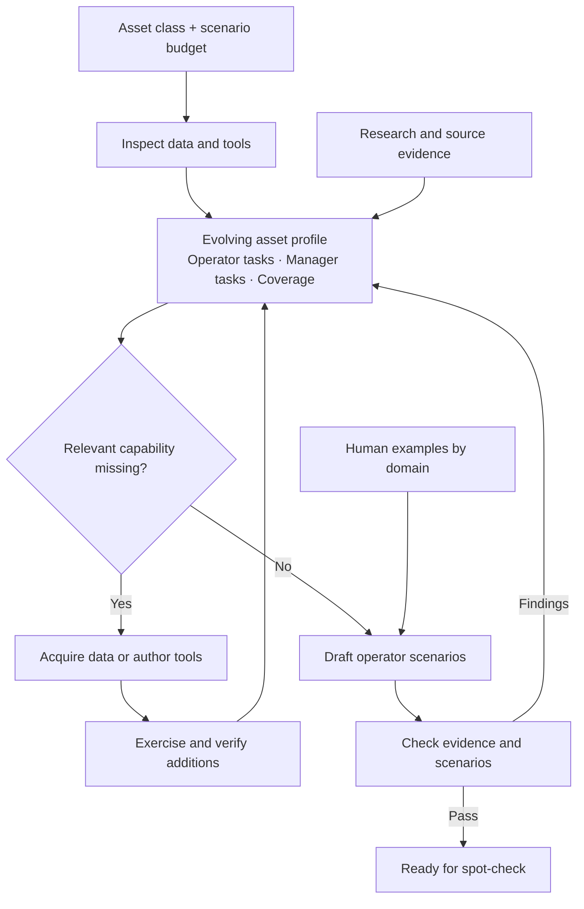

# Scenario generation

Generate scenarios for an asset class using native Codex, existing MCP tools and
source-backed data. Always perform academic research and learn the asset's sensors,
failure modes and operating tasks. By default, preparation may acquire grounded
records and extend tools. `--environment existing` keeps the supplied data and
tool implementations fixed. Evaluation runners remain separate.

## Run

Configure Docker, Codex and Kaggle once:

```bash
codex login
uv tool install kaggle
kaggle auth login
```

From the repository checkout:

```bash
PYTHONPATH=src python -m scenarios.generation --asset Transformer
```

After installing the project, the equivalent command is
`scenario-generate --asset Transformer`. Defaults: 20 positive and 5 negative
scenarios, allocated by the agent; MCP tools and code execution;
Codex / GPT-6 Astra / `xhigh` / `fast` for generation.

```bash
scenario-generate --asset Transformer --mode general-execution --counts '{"positive":5,"negative":1}'
scenario-generate --asset Chiller --environment existing
scenario-generate --asset Transformer --plan '{"iot":{"positive":2,"negative":1},"multiagent":{"positive":1}}'
scenario-generate run /path/to/run --followup "Check the unresolved source claims."
scenario-generate check /path/to/run
scenario-generate inspect /path/to/run
scenario-generate watch /path/to/run
scenario-generate stop /path/to/run
```

## Arguments

| Argument | Meaning / default |
| --- | --- |
| `[action]` | `run` (default), `check`, `inspect`, `watch`, `stop`, or `build`. |
| `[directory]` | New output directory or saved run. New runs default to the local cache. |
| `--asset NAME` | Required for a new generation. |
| `--counts JSON` | Positive/negative totals; the agent chooses the domain mix. Defaults to 20 positive, 5 negative. |
| `--plan JSON` | Exact positive/negative counts per domain. Mutually exclusive with totals. |
| `--mode MODE` | `general-execution` (default). `mcp-only` remains for legacy compatibility. |
| `--environment POLICY` | `extend` (default) permits grounded preparation; `existing` uses only the selected checkout's data and tools. Independent of `--mode`. |
| `--harness NAME` | `codex`, currently the only implementation. |
| `--model MODEL` | `gpt-6-astra`. |
| `--reasoning LEVEL` | `xhigh`. |
| `--tier TIER` | `fast`. |
| `--temperature FLOAT` | Optional request in `[0, 2]`. The current Codex CLI harness cannot apply temperature and rejects this option before preparing a run. |
| `--repo PATH` | Environment source checkout; current directory. |
| `--ref REF` | Committed environment revision; `HEAD`. |
| `--followup TEXT` | Fresh session continuing saved files and database; retains the saved budget and generation mode. |
| `-h`, `--help` | Show usage. |

Plan keys are `iot`, `fmsr`, `tsfm`, `wo`, `vibration`, and `multiagent`.
Each value contains `positive` and/or `negative` nonnegative integers; omitted
entries mean zero. At least one scenario is required. Capitalized domain names
and `multi-agent` are normalized. `multiagent` combines at least two tool domains.

A positive scenario must be answerable with the environment; a negative scenario
intentionally tests an unsupported request or missing evidence. This budget counts
scenarios, not tokens or money. The agent saves its allocation and reports any
shortfall without substituting one polarity for another. `check` enforces both
the supplied budget and the per-domain allocation. There are no separate count or
domain flags.

The generator uses Codex CLI through its native login. Evaluation uses Stirrup
with MCP tools, shell/Python analysis and file creation. Legacy MCP-only runs
remain readable but are not a separate track in the current study. Scenario contracts
declare required capabilities and input/output files. The harness records execution
automatically; the generator does not write tool-call ledgers or execution receipts.
Prepared outputs, rubrics and generator scripts are not evaluation inputs. During
evaluation, agent-created task files and MCP-produced files share one workspace;
the generated server implementation remains private to the tool container.

Negatives test missing data, wrong asset/site, absent channels, insufficient
coverage or unsupported domain conclusions. Missing file-writing capability and
runtime failures do not qualify. Follow-ups cannot change mode. Legacy results
without a mode remain readable and checkable with a compatibility warning; start
a new generation to evaluate either declared mode.

Requested model settings and prompt hashes are saved per invocation. Unsupported
model settings surface as CLI errors. `harnesses.py` is the boundary for future
clients; authentication stays with the native client.

Temperature is not configurable through the current Codex CLI harness. Do not
report these runs as `temperature=0`: `requested_temperature: null` in the run
metadata means no override was requested. Explicit requests, including
`--temperature 0`, fail before creating a workspace or starting containers.
An effective override requires a harness and model that support temperature.
Even then, temperature zero alone does not guarantee identical scenarios when
live research results, data, or tool implementations change. Retain the actual
scenarios, reference answers, environment/data snapshot, and evaluation outputs
alongside the configuration used for the reported results.

## Environment

A new run exports the selected checkout's committed server, loader and tool code,
including fixtures, tests and model artifacts. Use `--repo` and `--ref` to
choose another committed environment; defaults are the current checkout and HEAD.
There are no asset-specific exclusions. Uncommitted edits are not exported.

The environment policy is saved in the request and cannot change on follow-up.
Legacy requests without it retain `extend`. With `existing`, source is mounted
read-only and the harness captures the initialized input database state. Checks
reject changed source, new operational data roots and changes to input collections.
Research and literature downloads remain available. Lossless file representations
of existing records may support existing file-based tools; their lineage and task
inputs must be declared. Task mutations are exercised on disposable copies and
restored; native TSFM run/result ledgers are outputs, not added input data.

The command builds its Docker image if needed, starts an isolated CouchDB volume,
and loads the repository's normal default manifest. Follow-up sessions reuse the
saved source and database. It does not connect to or modify the host database.
Preparing a different starting environment is an experiment setup choice, outside
the generation prompt. The agent reads only its asset/scope request and normal
instructions in [profile.md](prompts/profile.md) and [generate.md](prompts/generate.md).

The container mounts the generated workspace and read-only Codex/Kaggle credentials.
Kaggle uses a private copy inside the disposable container so OAuth can refresh
without modifying host credentials.
It has native shell, file editing and web search; the Docker socket, host checkout
and Git history are not mounted. Credentials remain accessible to the native
clients in the container. No credentials belong in prompts or Git.

Set `SEMANTIC_SCHOLAR_API_KEY` in the selected repository's private `.env` or
export it in your shell. Exported values take precedence. Only this research key
is forwarded from dotenv; the file is not mounted. The generation-only MCP tool
`research.search_papers` saves query receipts and paper results automatically.
The key is not placed in command arguments, saved configuration or receipts.

## Generation principles



The profile describes verified capabilities after preparation. Sensor coverage and
relevant tools can grow as the agent adds support. Human examples guide voice and
complexity; their identities and answers do not establish facts in the new environment.

Scenarios require a concrete analysis, decision, forecast for a stated need, or
authorized action. Lookups are supporting steps, never complete scenarios. Profiling
and statistics comparisons must answer an operational or analytical question.

Each characteristic form includes a reference answer grounded in exercised results:
actual values, identifiers and decisions where determined, with units and tolerances
as needed. Variable outcomes use supported acceptance criteria. These answers remain
separate from the operator request and evaluation inputs.

Operational data in `extend` must be grounded in verified existing records or real datasets.
Synthetic extensions retain their observed inputs, field mappings and reproducible
transformations. Literature grounds domain knowledge; it does not replace data
provenance. Missing suitable data leaves a documented gap and any resulting quota
shortfall. The checker rejects missing or circular data lineage; relevance and
transformation fidelity still require review.

In `existing`, supplied benchmark records may instead use `kind: "fixture"`,
with original files checked against the protected baseline. This permits the
existing benchmark surface without claiming verified real-world provenance.
Document unknown units, original provenance and diagnostic limits. Research does
not establish missing measurements. Unsupported domain quotas remain explicit
shortfalls; the policy cannot be relaxed to fill them.

The agent can run `python -m scenarios.generation.review --workspace /workspace --stage profile`
before drafting, or `--stage all` before finishing. Both use the read-only checker
supplied by the runtime. The prompts define the research, profile and scenario
contracts; the agent chooses how to complete the work.

## Results

The command prints its output directory, under `~/.cache/assetopsbench/generation`
by default. Open `workspace/output/README.md` for scenarios, sources, capabilities
and gaps. Raw data and agent traces stay in this local directory.

`run` checks the saved results after Codex finishes and allows up to two repair
attempts. It records process and validation status separately; unresolved errors
leave the run incomplete. `check` verifies profile structure, source references,
hashes, budgets, duplicates, tools and applicable live grounding, saving its own
MCP calls and results. It ignores legacy `tool_checks.json` and manual execution
receipts. The report marks scenario execution as `not_verified`: run the scenarios
to verify output creation, complete workflows and negative-case behavior. Scientific
validity and operator realism still require review.

`inspect` shows status, recent events and linked artifacts. `watch` follows live
messages, searches and tool activity; Ctrl-C stops only the viewer. `logs/index.md`
is the saved evidence index. Native events, research receipts and each attempt's
checks remain available. `stop` retains the database for later review or follow-up.

Tests: `python -m pytest src/scenarios/generation/tests -q`.
