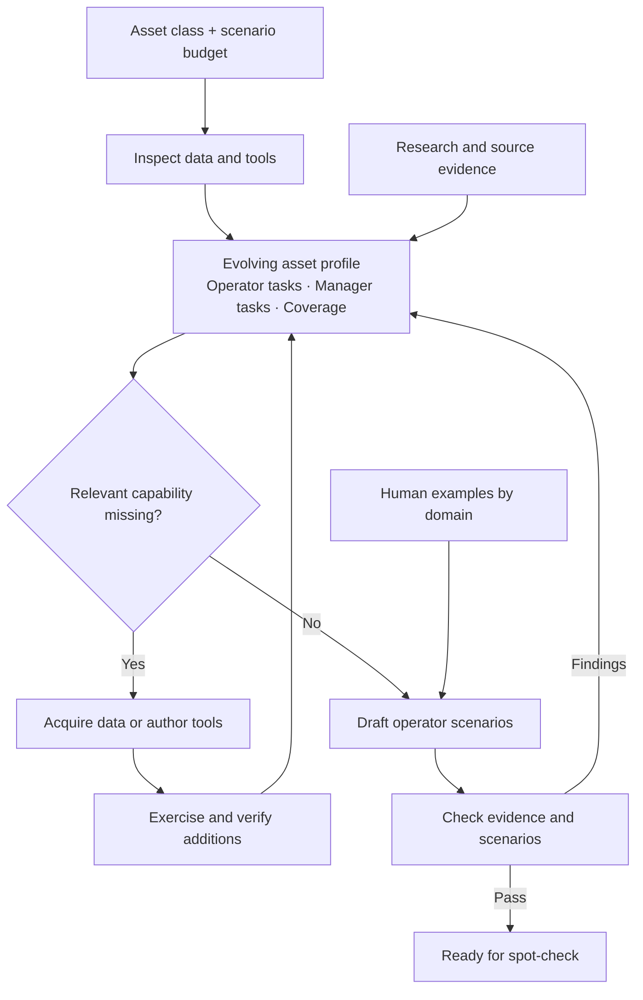

# Scenario generation

Generate scenarios for an asset class using native Codex, existing MCP tools and
source-backed data. Inspect and reuse the environment first; research, seed data
or add tools only for missing capabilities. Evaluation runners remain separate.

## Run

Configure Docker, Codex and Kaggle once:

```bash
codex login
uv tool install kaggle
kaggle auth login
```

From the repository checkout:

```bash
PYTHONPATH=src python -m scenarios.generation --asset-class Transformer
```

After installing the project, the equivalent command is
`scenario-generate --asset-class Transformer`. Defaults: 50 positive and 2 negative
scenarios, allocated by the agent; Codex / GPT-6 Astra / `xhigh` / `fast`.

```bash
scenario-generate --asset-class Transformer --scenario-counts '{"positive":5,"negative":1}'
scenario-generate --asset-class Transformer --scenario-plan '{"iot":{"positive":2,"negative":1},"multiagent":{"positive":1}}'
scenario-generate run /path/to/run --followup "Check the unresolved source claims."
scenario-generate check /path/to/run
scenario-generate inspect /path/to/run
scenario-generate watch /path/to/run
scenario-generate stop /path/to/run
```

## Arguments

| Argument | Meaning / default |
| --- | --- |
| `[action]` | `run` (default), `check`, `inspect`, `watch`, `stop`, or `build`. |
| `[directory]` | New output directory or saved run. New runs default to the local cache. |
| `--asset-class NAME` | Required for a new generation. |
| `--scenario-counts JSON` | Positive/negative totals; the agent chooses the domain mix. Defaults to 50 positive, 2 negative. |
| `--scenario-plan JSON` | Exact positive/negative counts per domain. Mutually exclusive with totals. |
| `--harness NAME` | `codex`, currently the only implementation. |
| `--model MODEL` | `gpt-6-astra`. |
| `--reasoning-effort LEVEL` | `xhigh`. |
| `--service-tier TIER` | `fast`. |
| `--repository PATH` | Environment source checkout; current directory. |
| `--ref REF` | Committed environment revision; `HEAD`. |
| `--followup TEXT` | Fresh session continuing saved files and database; retains the saved budget. |
| `-h`, `--help` | Show usage. |

Plan keys are `iot`, `fmsr`, `tsfm`, `wo`, `vibration`, and `multiagent`.
Each value contains `positive` and/or `negative` nonnegative integers; omitted
entries mean zero. At least one scenario is required. Capitalized domain names
and `multi-agent` are normalized. `multiagent` combines at least two tool domains.

A positive scenario must be answerable with the environment; a negative scenario
intentionally tests an unsupported request or missing evidence. This budget counts
scenarios, not tokens or money. The agent saves its allocation and reports any
shortfall without substituting one polarity for another. `check` enforces both
the supplied budget and the per-domain allocation. There are no separate count or
domain flags.

Requested model settings and prompt hashes are saved per invocation. Unsupported
model settings surface as CLI errors. `harnesses.py` is the boundary for future
clients; authentication stays with the native client.

## Environment

A new run exports the selected checkout's committed server, loader and tool code,
including fixtures, tests and model artifacts. Use `--repository` and `--ref` to
choose another committed environment; defaults are the current checkout and HEAD.
There are no asset-specific exclusions. Uncommitted edits are not exported.

The command builds its Docker image if needed, starts an isolated CouchDB volume,
and loads the repository's normal default manifest. Follow-up sessions reuse the
saved source and database. It does not connect to or modify the host database.
Preparing a different starting environment is an experiment setup choice, outside
the generation prompt. The agent reads only its asset/scope request and normal
instructions in [profile.md](prompts/profile.md) and [generate.md](prompts/generate.md).

The container mounts the generated workspace and read-only Codex/Kaggle credentials.
It has native shell, file editing and web search; the Docker socket, host checkout
and Git history are not mounted. Credentials remain accessible to the native
clients in the container. No credentials belong in prompts or Git.

Set `SEMANTIC_SCHOLAR_API_KEY` in the selected repository's private `.env` or
export it in your shell. Exported values take precedence. Only this research key
is forwarded from dotenv; the file is not mounted. The generation-only MCP tool
`research.search_papers` saves query receipts and paper results automatically.
The key is not placed in command arguments, saved configuration or receipts.

## Generation principles



The profile describes verified capabilities after preparation. Sensor coverage and
relevant tools can grow as the agent adds support. Human examples guide voice and
complexity; their identities and answers do not establish facts in the new environment.

All operational data must be grounded in verified existing records or real datasets.
Synthetic extensions retain their observed inputs, field mappings and reproducible
transformations. Literature grounds domain knowledge; it does not replace data
provenance. Missing suitable data leaves a documented gap and any resulting quota
shortfall. The checker rejects missing or circular data lineage; relevance and
transformation fidelity still require review.

The agent can run `python -m scenarios.generation.review --workspace /workspace --stage profile`
before drafting, or `--stage all` before finishing. Both use the read-only checker
supplied by the runtime. The prompts define the research, profile and scenario
contracts; the agent chooses how to complete the work.

## Results

The command prints its output directory, under `~/.cache/assetopsbench/generation`
by default. Open `workspace/output/README.md` for scenarios, sources, capabilities
and gaps. Raw data and agent traces stay in this local directory.

`run` checks the saved results after Codex finishes and allows up to two repair
attempts. It records process and validation status separately; unresolved errors
leave the run incomplete. `check` verifies profile structure, source references,
hashes, budgets, duplicates, tools and applicable live grounding. It does not
establish scientific validity or operator realism. Review those separately.

`inspect` shows status, recent events and linked artifacts. `watch` follows live
messages, searches and tool activity; Ctrl-C stops only the viewer. `logs/index.md`
is the saved evidence index. Native events, research receipts and each attempt's
checks remain available. `stop` retains the database for later review or follow-up.

Tests: `python -m pytest src/scenarios/generation/tests -q`.
